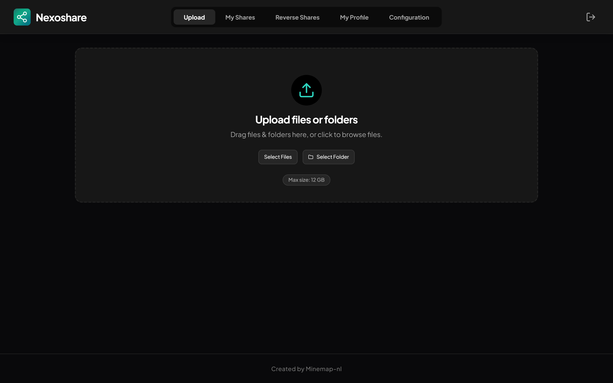
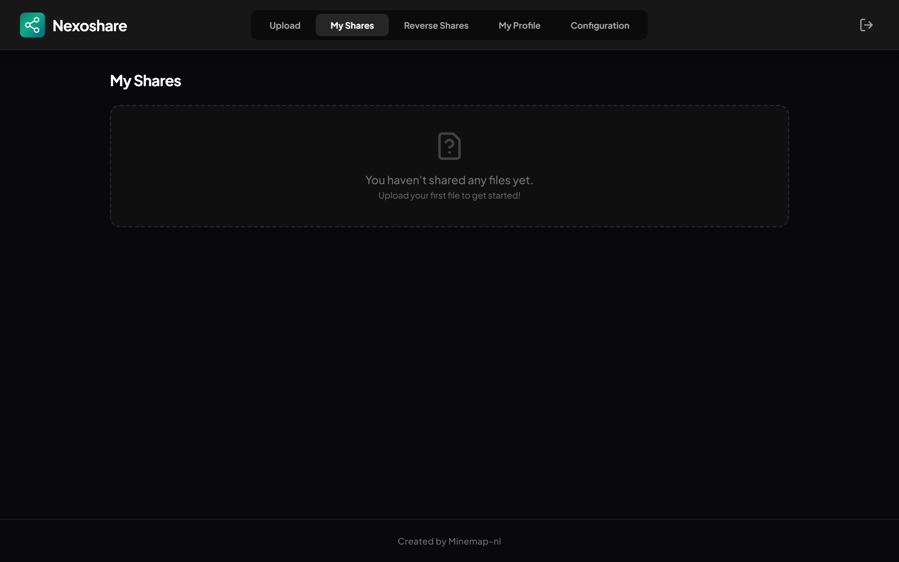
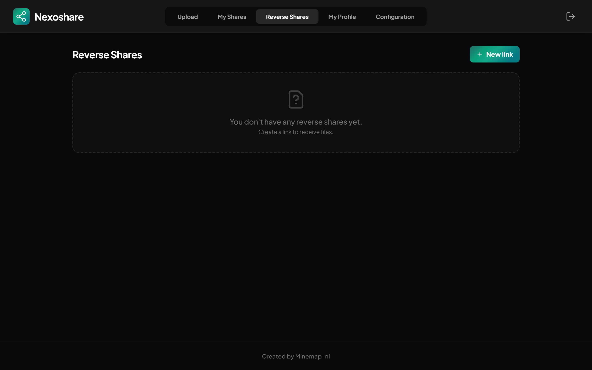
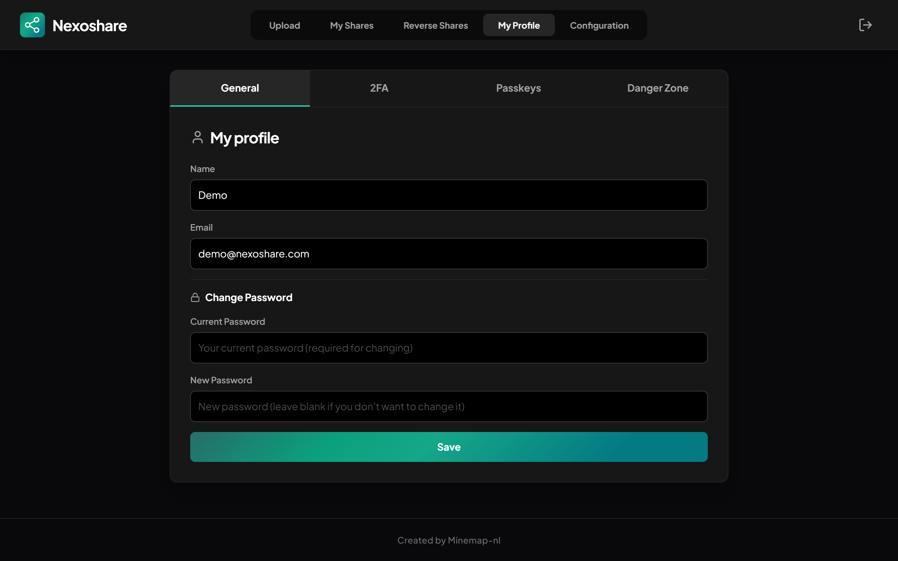

<a id="readme-top"></a>

<br />
<div align="center">
  <a href="https://nexoshare.famretera.nl">
    
  </a>

  <h3 align="center">Nexo Share</h3>

  <p align="center">
    A powerful, self-hosted, and secure file-sharing platform.<br />
    Share large files securely with password protection, expiration dates, and 2FA support.
    <br /><br />
    <a href="https://nexoshare.famretera.nl"><strong>View Demo & More Info »</strong></a>
    <br /><br />
    <a href="https://github.com/minemap-nl/nexoshare/issues/new?labels=bug&template=bug-report---.md">Report Bug</a>
    &middot;
    <a href="https://github.com/minemap-nl/nexoshare/issues/new?labels=enhancement&template=feature-request---.md">Request Feature</a>
  </p>
</div>

---

<details>
<summary><strong>Table of Contents</strong></summary>
<ol>
  <li>
    <a href="#about-the-project">About The Project</a>
    <ul>
      <li><a href="#screenshots">Screenshots</a></li>
      <li><a href="#built-with">Built With</a></li>
    </ul>
  </li>
  <li><a href="#key-features">Key Features</a></li>
  <li>
    <a href="#getting-started">Getting Started</a>
    <ul>
      <li><a href="#prerequisites">Prerequisites</a></li>
      <li><a href="#installation-docker">Installation (Docker)</a></li>
    </ul>
  </li>
  <li><a href="#usage">Usage</a></li>
  <li><a href="#license">License</a></li>
  <li><a href="#contact">Contact</a></li>
</ol>
</details>

---

## About The Project

**Nexo Share** is designed as a secure alternative to public file transfer services. It allows you to host your own file-sharing platform while retaining full control over your data.

Unlike many standard open-source solutions, Nexo Share focuses heavily on security-first features such as **(mandatory) 2FA**, **passkey authentication**, and **ClamAV virus scanning**, while still offering user-friendly workflows like **Reverse Shares** that allow external users to send files to you without creating an account.

### Screenshots

<div align="center">
  
  
  <br/>
  
  
</div>

<p align="right">(<a href="#readme-top">back to top</a>)</p>

### Built With

* [React][react-url]
* [TypeScript][typescript-url]
* [Bun][bun-url]
* [Express][express-url]
* [PostgreSQL][postgresql-url]
* [Docker][docker-url]

<p align="right">(<a href="#readme-top">back to top</a>)</p>

---

## Key Features

* **🔒 Secure Sharing** — Password-protected shares with automatic expiration.
* **📂 Chunked Uploads** — Reliably upload very large files and folders (limited only by server storage).
* **🔄 Reverse Shares** — Public drop-off links that allow guests to securely upload files to you.
* **🛡️ Advanced Security**
  * Two-Factor Authentication (TOTP)
  * Passkey support (Face ID, Touch ID, Windows Hello)
  * ClamAV virus scanning integration
* **🔑 SSO Support** — OpenID Connect (OIDC) integration.
* **⚙️ Admin Dashboard** — Manage users, global settings, SMTP configuration, and audit logs.

<p align="right">(<a href="#readme-top">back to top</a>)</p>

---

## Getting Started

The recommended way to install **Nexo Share** is via **Docker**.

### Prerequisites

* **Docker** and **Docker Compose** installed on your server.

### Installation (Docker)

1. Create a directory for the project and navigate into it.
2. Create a file named `docker-compose.yml`.
3. Paste the following configuration:

```yaml
services:
  nexoshare:
    image: ghcr.io/minemap-nl/nexoshare:latest
    container_name: nexoshare
    restart: unless-stopped
    ports:
      - "3000:3000"
    environment:
      PORT: 3000
      DB_HOST: postgres
      DB_PORT: 5432
      DB_NAME: nexoshare
      DB_USER: nexoshare
      DB_PASSWORD: CHANGE_THIS_PASSWORD
      JWT_SECRET: CHANGE_THIS_SECRET
      UPLOAD_DIR: /app/backend/uploads
      APP_URL: http://localhost:3000
      ALLOWED_ORIGINS: http://localhost:3000
      NODE_ENV: production
      TZ: UTC
      APP_LOCALE: en-GB
      CLAMAV_HOST: clamav
      CLAMAV_PORT: 3310
    volumes:
      - ./uploads:/app/backend/uploads
    depends_on:
      postgres:
        condition: service_healthy
      clamav:
        condition: service_healthy

  postgres:
    image: postgres:17-alpine
    container_name: nexoshare_db
    restart: unless-stopped
    environment:
      POSTGRES_USER: nexoshare
      POSTGRES_PASSWORD: CHANGE_THIS_PASSWORD
      POSTGRES_DB: nexoshare
    healthcheck:
      test: ["CMD-SHELL", "pg_isready -U nexoshare -d nexoshare"]
      interval: 10s
      timeout: 5s
      retries: 5
    volumes:
      - ./data:/var/lib/postgresql/data

  clamav:
    image: clamav/clamav:latest
    container_name: nexoshare_clamav
    restart: unless-stopped
    healthcheck:
      test: ["CMD", "nc", "-z", "localhost", "3310"]
      interval: 30s
      timeout: 10s
      retries: 5
      start_period: 120s
    volumes:
      - ./clamav:/var/lib/clamav
```

4. Start the stack:

```sh
docker compose up -d
```

<p align="right">(<a href="#readme-top">back to top</a>)</p>

---

## Usage

Once the containers are running, open:

```
http://localhost:3000
```

(or your configured domain).

### First-Time Setup

On first startup, database tables are created automatically. If no users exist, a default admin account is created:

* **Email:** `admin@nexoshare.com`
* **Password:** `admin123`

> ⚠️ **Important:** Log in immediately and change these credentials.

<p align="right">(<a href="#readme-top">back to top</a>)</p>

---

## License

**Source Available – MIT with Commons Clause**

This project is licensed under the **MIT License** with the **Commons Clause** condition.

* ✅ You may use, copy, modify, and distribute this software for personal or internal business use.
* ✅ You may use this software to share files with clients or partners as part of normal business operations.
* ❌ You may **not** sell this software or offer it as a commercial SaaS product where the primary value comes from the software itself.

See the `LICENSE` file for details.

<p align="right">(<a href="#readme-top">back to top</a>)</p>

---

## Contact

**Minemap / Famretera**  
Website: https://nexoshare.famretera.nl

Project Repository: https://github.com/minemap-nl/nexoshare

<p align="right">(<a href="#readme-top">back to top</a>)</p>

---

[contributors-shield]: https://img.shields.io/github/contributors/minemap-nl/nexoshare.svg?style=for-the-badge
[contributors-url]: https://github.com/minemap-nl/nexoshare/graphs/contributors
[forks-shield]: https://img.shields.io/github/forks/minemap-nl/nexoshare.svg?style=for-the-badge
[forks-url]: https://github.com/minemap-nl/nexoshare/network/members
[stars-shield]: https://img.shields.io/github/stars/minemap-nl/nexoshare.svg?style=for-the-badge
[stars-url]: https://github.com/minemap-nl/nexoshare/stargazers
[issues-shield]: https://img.shields.io/github/issues/minemap-nl/nexoshare.svg?style=for-the-badge
[issues-url]: https://github.com/minemap-nl/nexoshare/issues
[license-shield]: https://img.shields.io/github/license/minemap-nl/nexoshare.svg?style=for-the-badge
[license-url]: https://github.com/minemap-nl/nexoshare/blob/main/LICENSE

[react-url]: https://reactjs.org/
[typescript-url]: https://www.typescriptlang.org/
[bun-url]: https://bun.sh/
[express-url]: https://expressjs.com/
[postgresql-url]: https://www.postgresql.org/
[docker-url]: https://www.docker.com/
